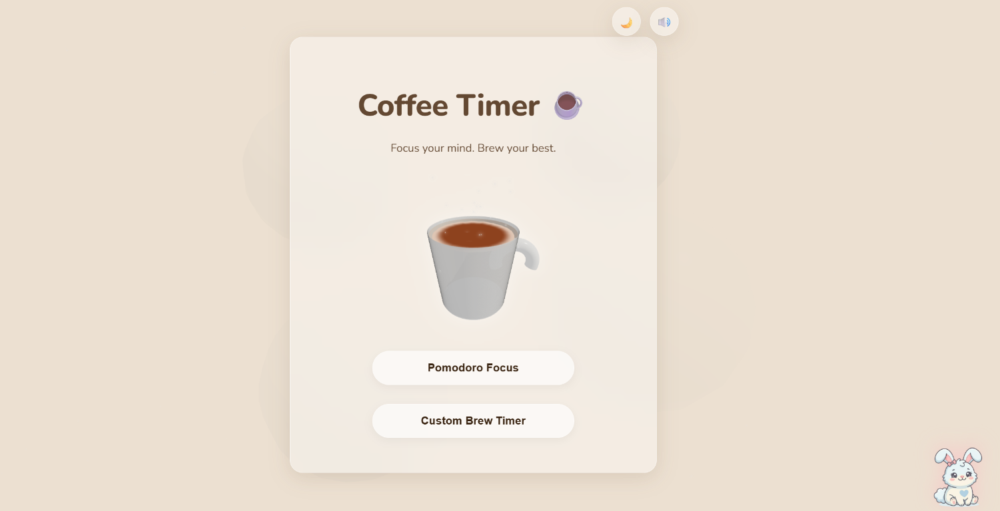
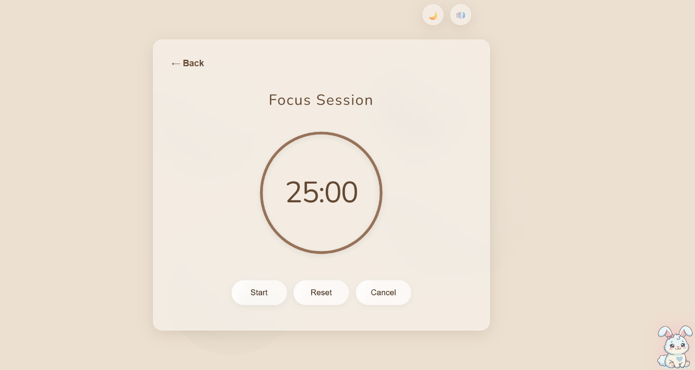
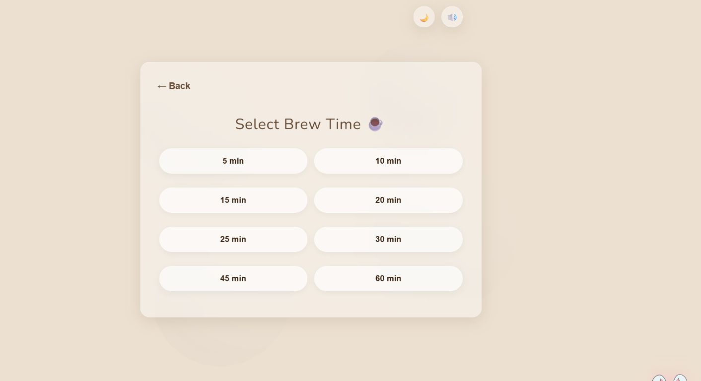

# ☕ Caffo

### A coffee-themed focus timer built for better focus sessions.

Caffo is a coffee-inspired productivity timer built with React and Vite. It combines Pomodoro sessions, custom brew intervals, animated 3D coffee visuals, ambient café audio, day/night themes, and Progressive Web App support into a cozy focus experience.

<p align="center">
  <a href="https://caffo.vercel.app/">🌐 Live Demo</a>
  ·
  <a href="https://github.com/Aadhi2306/Caffo">📦 GitHub Repository</a>
</p>

---

## ✨ Features

* ☕ **Pomodoro Timer** — Start a 25-minute focus session.
* ⏱️ **Custom Timer** — Choose your own focus duration.
* ▶️ **Timer Controls** — Start, pause, resume, reset, and cancel sessions.
* 📊 **Live Progress** — Visual feedback while the timer is running.
* 🔄 **Session Recovery** — Restore active or paused timer state after a page reload.
* 🌙 **Day/Night Themes** — Switch between different visual themes.
* 🎵 **Ambient Café Audio** — Optional background audio for a relaxed focus environment.
* 📱 **PWA Support** — Install Caffo on supported browsers and devices.
* 📡 **Offline Support** — Continue using the app offline after the application has been loaded and cached.
* ♿ **Accessibility** — Keyboard-operable controls, accessible labels, visible focus states, and screen-reader-friendly interactions.
* 🎨 **Animated 3D Visuals** — Coffee-themed animated visuals for an immersive experience.

---

## 🎥 See Caffo in Action

### App Preview

<p align="center">
  
</p>

### Pomodoro Timer

<p align="center">
  
</p>

### Custom Timer

<p align="center">
  
</p>

### 🎬 Demo Video

[▶️ Watch the Caffo demo](./assets/caffo-demo.mp4)

> A short walkthrough demonstrating the main Caffo experience, including Pomodoro sessions, custom timers, controls, themes, and timer recovery.

---

## 🌐 Live Demo

Try Caffo directly in your browser:

**[🌐 Open Caffo](https://caffo.vercel.app/)**

No installation is required.

---

## 🛠️ Tech Stack

| Technology                       | Purpose                                      |
| -------------------------------- | -------------------------------------------- |
| **React**                        | Frontend UI                                  |
| **Vite**                         | Development and production build tooling     |
| **JavaScript**                   | Application logic                            |
| **CSS**                          | Styling and responsive UI                    |
| **Three.js / React Three Fiber** | Animated 3D visuals                          |
| **Firebase**                     | Optional authentication and cloud statistics |
| **PWA**                          | Installable and offline-capable experience   |
| **ESLint**                       | Code quality and linting                     |
| **GitHub Spec Kit**              | Specification-driven development             |
| **Vercel**                       | Production hosting                           |

---

## 🧪 Validation

The project includes automated and browser-level validation.

| Check                 | Status |
| --------------------- | ------ |
| ESLint                | ✅      |
| Production Build      | ✅      |
| Timer Unit Tests      | ✅      |
| Timer State Recovery  | ✅      |
| Pomodoro Flow         | ✅      |
| Custom Timer Flow     | ✅      |
| Accessibility Checks  | ✅      |
| Offline Behavior      | ✅      |
| Production Deployment | ✅      |

### Run Timer Unit Tests

```sh
node --test src/utils/timerState.test.js
```

### Run ESLint

```sh
npm run lint
```

### Create a Production Build

```sh
npm run build
```

---

## 💻 Run Locally

### Requirements

* Node.js 18 or newer
* npm

### Clone the repository

```sh
git clone https://github.com/Aadhi2306/Caffo.git
cd Caffo
```

### Install dependencies

```sh
npm install
```

### Start the development server

```sh
npm run dev
```

Open the local URL shown in the terminal.

---

## 📦 Available Scripts

| Command                                    | Description                           |
| ------------------------------------------ | ------------------------------------- |
| `npm run dev`                              | Start the Vite development server     |
| `npm run lint`                             | Run ESLint across the project         |
| `npm run build`                            | Create a production build             |
| `npm run preview`                          | Preview the production build locally  |
| `node --test src/utils/timerState.test.js` | Run timer-state unit tests            |

---

## 📁 Project Structure

```text
Caffo/
│
├── assets/
│   ├── caffo-home.png
│   ├── caffo-pomodoro.png
│   ├── caffo-custom-timer.png
│   └── caffo-demo.mp4
│
├── public/
│   ├── manifest.json
│   └── sw.js
│
├── src/
│   ├── components/
│   │   └── React UI components
│   │
│   ├── utils/
│   │   └── timerState.js
│   │
│   └── ...
│
├── specs/
│   └── 001-brew-timer/
│       └── Feature specification and implementation documentation
│
├── .specify/
│   └── Spec Kit configuration and tooling
│
├── package.json
└── README.md
```

---

## 🔥 Firebase Configuration

Caffo includes Firebase Authentication and Firestore integration for optional account and focus-stat features.

The current values in `src/firebase.js` are placeholders. Replace them with configuration from your Firebase project and enable the Firebase services you use before expecting sign-in or cloud statistics to work.

**Never commit private credentials, passwords, API secrets, or other sensitive information to the repository.**

---

## ⭐ Support

If you find Caffo interesting, consider giving the repository a ⭐ on GitHub!

**[⭐ Star Caffo on GitHub](https://github.com/Aadhi2306/Caffo)**
